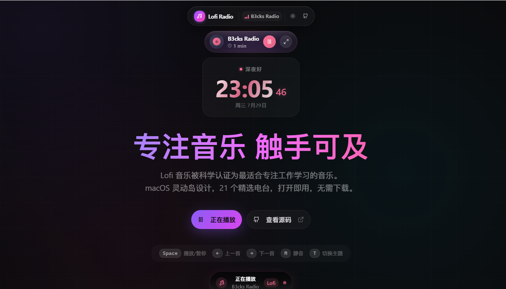

<h1 align="center">🎧 Lofi Radio Web</h1>

<div align="center">

**简体中文** · [🌐 English](./README.en-US.md)


**Lofi（Low Fidelity）低保真音乐，以稳定节奏、弱歌词干扰与舒缓氛围，常被用于工作、学习和创作等专注场景。**

macOS 风格灵动岛设计，21 个精选电台，打开即听，无需注册或下载。

**[🎧 在线体验](https://lofi.88lin.eu.org/)** · [✨ 功能特性](#-功能特性) · [🚀 快速开始](#-快速开始) · [☁️ 部署指南](#-部署指南) · [💬 Discussions](https://github.com/88lin/lofi-radio-web/discussions)

</div>

---

## ❤️ 赞助商

<table>
<tr>
<td width="180" align="center" valign="middle">
  <a href="https://manus.im/invitation/EBN1N2RKB6J8ZQI?utm_source=invitation&utm_medium=social&utm_campaign=copy_link"></a>
</td>
<td valign="middle"><b><a href="https://manus.im/invitation/EBN1N2RKB6J8ZQI?utm_source=invitation&utm_medium=social&utm_campaign=copy_link">Manus</a></b>&nbsp;限时免费，点此邀请链接注册即可得1500积分。Manus 1.6 Lite 和 Manus 1.6 在 8月25日（新加坡时间）之前免费使用，不会消耗积分。</td>
</tr>
<tr>
<td width="180" align="center" valign="middle">
  <a href="https://www.sheapi.top/sign-up?aff=MvcR"></a>
</td>
<td valign="middle"><b><a href="https://www.sheapi.top/sign-up?aff=MvcR">SheApi</a></b>&nbsp;是一家可靠高效的 API 中转服务提供商，主要提供 Claude Code、Codex 等主流模型的高稳定中转能力，Codex 倍率补贴低至 0.06，GPT-Image-2生图每张0.04。受邀注册送$1 体验金，每日签到还可领取专属免费额度。</td>
</tr>
<tr>
<td width="180" align="center" valign="middle">
  <a href="https://www.workbuddy.cn/events/invite?inviteCode=w0x2ic45z"></a>
</td>
<td valign="middle"><b><a href="https://www.workbuddy.cn/events/invite?inviteCode=w0x2ic45z">WorkBuddy</a></b>&nbsp;是腾讯出品的全能 AI 工作台，是中国最受欢迎的效率 AI 智能体服务，说出要求、开始执行任务、交付完整成果。其中Hy3模型限时免费使用，注册即可获取2000积分，每月再赠送500积分，可用Kimi-K3、GLM-5.2等模型。</td>
</tr>
<tr>
<td width="180" align="center" valign="middle">
  <a href="https://seekai.cc/sign-up?aff=Plh5"></a>
</td>
<td valign="middle"><b><a href="https://seekai.cc/sign-up?aff=Plh5">SeekAi</a></b>&nbsp;是免费公益大模型API平台，可用claude-fable-5、Claude-Opus-5、kimi-k3、gpt-5.6-sol、glm-5.2、DeepSeek-V4-Flash-0731等主流模型，目前较稳定。注册送＄200，每日签到得＄20，支持GitHub登录。</td>
</tr>
<tr>
<td width="180" align="center" valign="middle">
  <a href="https://gorouter.app/sign-up?aff=hfcV"></a>
</td>
<td valign="middle"><b><a href="https://gorouter.app/sign-up?aff=hfcV">GoRouter</a></b>&nbsp;是免费公益大模型API平台，可用Claude Opus 5 模型，目前较稳定。注册送＄70，每日签到得＄10左右，支持GitHub登录。</td>
</tr>
<tr>
<td width="180" align="center" valign="middle">
  <a href="https://agentrouter.org/register?aff=ugVO"></a>
</td>
<td valign="middle"><b><a href="https://agentrouter.org/register?aff=ugVO">Agent Router</a></b>&nbsp;是免费公益大模型API平台，支持GPT-5.6、Claude Opus 5 等主流模型，国内直连。注册送＄125，每日签到得＄25，被邀得＄50，支持GitHub/LinuxDo登录。</td>
</tr>
</table>

---

## ✨ 首页预览

<div align="center">

<a href="https://lofi.88lin.eu.org/">
  
</a>

<sub>暗色模式 · 灵动岛播放器、实时专注时钟与快捷控制</sub>

</div>

## 📖 项目简介

一个为专注场景而做的 Lofi Radio 网页版。Lofi音乐因节奏平稳、旋律循环、干扰较少，长期被公认为学习和工作场景中更适合作为背景音的音乐类型之一。项目采用 macOS 风格灵动岛设计，收录 21 个精选电台，打开即用。

### 🎯 设计理念

- **专注体验**：灵动岛设计，小巧轻量，安静陪伴不打扰
- **跨平台**：基于 Web 技术，覆盖桌面端与移动端
- **即开即用**：无需注册登录，无需下载安装，打开网页即可收听
- **PWA 支持**：可安装为独立窗口，获得更接近原生应用的使用体验

### 🧠 为什么 Lofi 适合专注场景

Lofi（Low Fidelity）低保真音乐常用于学习、编程、写作与办公等高专注任务。其典型特征包括：

- **节奏慢且稳定**（通常 60-90 BPM）
- **旋律简单、循环感强**
- **极少或没有歌词**
- **音色柔和**，常带雨声、黑胶噼啪声、环境底噪
- **情绪克制**，不刻意制造高潮

这些特征让 Lofi 更适合作为不抢占注意力的背景声音：

1. **减少语言干扰**：较少的歌词不容易打断阅读、写作与编程等语言任务。
2. **听感稳定可预测**：规律节奏与循环结构减少突兀变化，更适合长时间作为背景播放。
3. **营造陪伴氛围**：柔和的音色可以填补过于安静的环境，又不会刻意制造情绪高潮。

> [!NOTE]
> 音乐对专注状态的影响因人而异，建议根据自己的任务、感受和使用环境选择合适的声音与音量。

---

## ✨ 功能特性

### 🎵 音乐播放

| 功能 | 描述 |
|------|------|
| **21 精选电台** | 涵盖 Lofi、Chillhop、Jazz、Classical、Hip-Hop、Ambient 等多种风格 |
| **Bilibili 直播源** | 支持 Lofi Girl Bilibili 直播流，并提供 HLS/FLV 候选与故障回退 |
| **全球流媒体来源** | 集成 Lofi Cafe、SomaFM、Code Radio、Swiss Classic 等多来源 |
| **快捷切换** | 一键切换电台，并自动加载所选音源 |

### 🎨 界面设计

| 功能 | 描述 |
|------|------|
| **灵动岛播放器** | macOS 风格灵动岛设计，可自由拖动到屏幕任意位置 |
| **玻璃拟态效果** | 通过高斯模糊与透明层次保持界面轻盈 |
| **黑胶唱片动画** | 精美的黑胶唱片旋转动画，播放时自动旋转 |
| **暗色/亮色主题** | 支持一键切换，自动跟随系统主题 |
| **响应式设计** | 适配桌面端和移动端的不同屏幕尺寸 |

### ⌨️ 快捷键支持

| 快捷键 | 功能 |
|--------|------|
| `Space` | 播放 / 暂停 |
| `←` | 上一首 |
| `→` | 下一首 |
| `M` | 静音 / 取消静音 |
| `T` | 切换主题（暗色/亮色） |

### ⏱️ 专注计时

- 记录每日专注时长（仅在播放时计时）
- 帮助培养高效工作习惯
- 数据本地存储，每日自动重置

### 🌙 睡眠定时

- 支持 15/30/45/60/90/120 分钟快速设置
- 支持 1~480 分钟自定义时长
- 定时结束后自动暂停播放
- 睡眠定时状态支持本地持久化

---

## 📻 电台列表（共 21 个）

### 学习（3）

| 电台 | 风格标签 | 说明 |
|------|---------|------|
| **Lofi Girl** | Lofi / Chill | B站直播源，国内访问友好 |
| **Lofi Box** | Lofi / Chill | 经典 Lofi 流 |
| **Lofi Studying** | Lofi / Study | 学习向场景电台 |

### 编程（2）

| 电台 | 风格标签 | 说明 |
|------|---------|------|
| **Groove Salad** | Chill / Ambient | 长时间编码友好 |
| **Code Radio** | Lofi / Coding | freeCodeCamp 编程电台 |

### 阅读（4）

| 电台 | 风格标签 | 说明 |
|------|---------|------|
| **Chill Sky** | Chill / Electro | 轻电子氛围 |
| **Lofi Japanese** | Japanese / Lofi | 日系 Lofi 氛围 |
| **Jazz Box** | Jazz / Smooth | 柔和爵士流 |
| **B3cks Radio** | Lofi / Relax | 放松导向 Lofi |

### 放松（3）

| 电台 | 风格标签 | 说明 |
|------|---------|------|
| **Chill Wave** | Chill / Electro | 氛围电子 |
| **Lofi Chilling** | Lofi / Chill | 低压陪伴型背景音 |
| **Paradise** | Chill / Alt | 多元轻松风格 |

### 助眠（4）

| 电台 | 风格标签 | 说明 |
|------|---------|------|
| **Rain Sounds** | Ambient / Nature | 白噪音与自然声 |
| **Lofi Sleeping** | Lofi / Sleep | 睡前低刺激流 |
| **Drone Zone** | Ambient / Deep | 深层氛围音墙 |
| **ASP** | Ambient / Sleep | 极简助眠氛围 |

### 专注（1）

| 电台 | 风格标签 | 说明 |
|------|---------|------|
| **Swiss Classic** | Classical / Symphony | 古典交响专注场景 |

### 其他（4）

| 电台 | 风格标签 | 场景 |
|------|---------|------|
| **Jazz Groove** | Jazz / Groove | 写作 |
| **Jazz Smooth** | Jazz / Mellow | 办公 |
| **Rap Beats** | Hip-Hop / Beats | 运动 |
| **Lofi Gaming** | Lofi / Gaming | 娱乐 |

> [!NOTE]
> 本仓库不托管电台音频。第三方流媒体可能因上游维护、地区限制或网络环境暂时不可用，遇到问题时可先切换其他电台。

---

## 🧰 技术栈

| 技术 | 描述 |
|------|------|
| [Next.js 16](https://nextjs.org/) | React 全栈框架，App Router |
| [React 19](https://react.dev/) | 用户界面库 |
| [TypeScript](https://www.typescriptlang.org/) | 类型安全 |
| [Tailwind CSS v4](https://tailwindcss.com/) | 原子化 CSS |
| [Framer Motion](https://www.framer.com/motion/) | 动画库 |
| [Zustand](https://zustand-demo.pmnd.rs/) | 轻量级状态管理 |
| [HLS.js](https://hlsjs.org/) | HLS 流媒体播放 |
| [flv.js](https://github.com/bilibili/flv.js) | B站 FLV 直播流播放 |
| [Lucide Icons](https://lucide.dev/) | 图标库 |

---

## 🚀 快速开始

### 环境要求

- Node.js `20.9` 或更高版本（Next.js 16 要求）
- npm、yarn、pnpm 或 bun

> [!TIP]
> 仓库已提交 `package-lock.json`。首次安装或 CI 环境建议使用 `npm ci`，需要更新依赖时再使用 `npm install`。

### 本地开发

```bash
# 克隆仓库
git clone https://github.com/88lin/lofi-radio-web.git
cd lofi-radio-web

# 安装锁定版本的依赖
npm ci

# 启动开发服务器
npm run dev
```

打开浏览器访问 [http://localhost:3000](http://localhost:3000)。

### 构建生产版本

```bash
# 构建
npm run build

# 启动生产服务器
npm run start
```

---

## ☁️ 部署指南

> [!TIP]
> **部署自己的版本前，建议先 Fork 本仓库。**
>
> 1. 访问 [lofi-radio-web](https://github.com/88lin/lofi-radio-web) 仓库主页
> 2. 点击右上角的 **Fork** 按钮
> 3. 等待 Fork 完成，你将在自己的 GitHub 账号下看到 `lofi-radio-web` 仓库的副本
>
> 下列部署方式均以你 Fork 后的仓库为基础。

### 部署前先确认

> [!IMPORTANT]
> 本项目包含服务端 API，不是纯静态站点。部署平台必须支持 Next.js Node.js 服务端运行时，并允许服务端访问外部 API。

运行环境需要满足：

- 运行时要求：Node.js `>= 20.9.0`
- 应用类型：标准 Next.js 服务端应用，不是纯静态站点
- API 依赖：`/api/bilibili-stream` 显式使用 Node.js runtime
- 外网访问：部署环境需要允许服务端访问 `api.live.bilibili.com` 和 `api.github.com`

### 部署到 Vercel（推荐）

[Vercel](https://vercel.com) 与当前仓库结构匹配，是优先推荐的托管方式。

[](https://vercel.com/new/clone?repository-url=https://github.com/88lin/lofi-radio-web)

1. 点击上方按钮，或访问 [Vercel Dashboard](https://vercel.com/dashboard)
2. 导入你 Fork 的 `lofi-radio-web` 仓库
3. 保持默认 Framework Preset 为 `Next.js`
4. Build Command 使用默认值，或显式填写 `npm run build`
5. 安装命令保持默认值，或显式填写 `npm install`
6. Node.js 版本设置为 `20.x` 或更高
7. 当前默认公开功能通常不需要额外环境变量，直接点击 `Deploy` 即可

如果后续你在自己的分支中启用了数据库、鉴权或其他扩展能力，再按你的改动补充对应环境变量。

### 部署到标准 Node.js 服务器（推荐）

如果你使用自己的 Linux 服务器、云主机、PaaS 或面板，推荐按标准 Next.js Node 服务方式部署。

```bash
# 安装依赖
npm install

# 构建
npm run build

# 启动生产服务
npm run start
```

默认监听端口为 `3000`。如果你需要反向代理，可以直接把 Nginx / Caddy 指向这个端口。

仓库中已包含一个可参考的 [Caddyfile](./Caddyfile)，适合本地或自托管场景做反向代理。

### Docker 部署（推荐）

仓库根目录现已提供可直接使用的 [Dockerfile](./Dockerfile)。

```bash
# 构建镜像
docker build -t lofi-radio-web .

# 运行容器
docker run -d --name lofi-radio-web -p 3000:3000 --restart unless-stopped lofi-radio-web
```

容器启动后，应用会在容器内执行 `npm run start`，默认对外提供 `3000` 端口。

### Cloudflare Pages / Netlify / 其他平台

> [!CAUTION]
> 纯静态导出无法承载本项目的服务端 API。使用 Cloudflare Pages、Netlify 或其他平台前，请先确认其 Next.js 服务端适配器、Node.js 版本与出网策略。

需要重点确认：

- 本项目包含服务端 API，而不是纯静态页面
- `/api/bilibili-stream` 依赖 Node.js runtime 和服务端出网请求
- 不同平台对 Next.js server runtime、适配器、Node.js 版本和网络策略的支持差异较大

如果你熟悉这些平台，可以自行验证适配方案；否则建议优先使用：

- Vercel
- 标准 Node.js 服务器
- Docker + 反向代理

---

## 🗂️ 项目结构

```
lofi-radio-web/
├── src/
│   ├── app/                      # Next.js App Router
│   │   ├── page.tsx             # 首页
│   │   ├── layout.tsx           # 根布局
│   │   ├── globals.css          # 全局样式
│   │   ├── robots.ts            # robots.txt 路由
│   │   ├── sitemap.ts           # sitemap.xml 路由
│   │   └── api/                 # API 路由
│   │       └── bilibili-stream/ # B站直播流解析
│   ├── components/              # 组件
│   │   ├── lofi/                # Lofi 相关组件
│   │   │   └── floating-player.tsx  # 浮动播放器
│   │   ├── ui/                  # UI 基础组件
│   │   └── theme-provider.tsx   # 主题提供者
│   ├── hooks/                   # 自定义 Hooks
│   │   ├── useAudioPlayer.ts    # 音频播放逻辑
│   │   ├── useFocusTimer.ts     # 专注计时
│   │   ├── useSleepTimer.ts     # 睡眠定时
│   │   └── use-toast.ts         # Toast 提示
│   ├── lib/                     # 工具库
│   │   ├── stations.ts          # 电台配置
│   │   ├── seo.ts               # SEO 配置与 metadata/schema 构建
│   │   ├── seo-content.ts       # FAQ 等 SEO 文案内容
│   │   └── utils.ts             # 工具函数
│   └── store/                   # 状态管理
│       └── audioStore.ts        # 音频状态
├── assets/                      # README 图片资源
├── public/                      # 静态资源
│   ├── logo.svg                 # Logo
│   └── manifest.json            # PWA 配置
├── scripts/                     # 构建辅助脚本
│   └── submit-indexnow.ts       # 手动提交 IndexNow
├── package.json
├── Dockerfile
├── tailwind.config.ts
├── next.config.ts
└── LICENSE
```

---

## 🔄 电台资源维护

本项目电台资源采用「基础源 + 人工精选扩展」策略：

- 基础参考来源： [labilio/lofi-radio](https://github.com/labilio/lofi-radio/blob/main/stations.json)
- 扩展来源：Lofi Cafe、SomaFM、Code Radio 及其他公开流媒体电台

更新方式：

1. 评估新电台源的可用性与稳定性
2. 更新 `src/lib/stations.ts` 中的 `stations` 数组
3. 同步更新 `README.md` 与 `README.en-US.md` 的电台列表和总数
4. 提交更改

### SEO 相关文件

- `src/lib/seo.ts`：集中管理 metadata、Open Graph、Twitter、Schema、robots 和 sitemap 配置
- `src/lib/seo-content.ts`：管理首页 FAQ 等 SEO 可见文案内容
- `src/app/robots.ts`：生成 `/robots.txt`
- `src/app/sitemap.ts`：生成 `/sitemap.xml`

---

## 💬 反馈与协作

为了让反馈更快进入可处理状态，请按内容选择入口：

- [💬 Discussions](https://github.com/88lin/lofi-radio-web/discussions)：
  使用问题、开放讨论、思路交流、暂不确定是否属于缺陷的问题
- [🐛 Bug 反馈](https://github.com/88lin/lofi-radio-web/issues/new/choose)：
  可复现的功能异常、回归问题、播放器或 API 故障
- [🚀 功能建议](https://github.com/88lin/lofi-radio-web/issues/new/choose)：
  新特性、交互优化、维护体验改进
- [🛠️ 部署 / 环境问题](https://github.com/88lin/lofi-radio-web/issues/new/choose)：
  安装、构建、部署、环境变量与平台兼容问题
- [📻 电台源补充 / 内容维护](https://github.com/88lin/lofi-radio-web/issues/new/choose)：
  新增电台、修复失效源、更新 README / 文案

仓库已启用结构化 Issue 模板、PR 模板和自动维护流程。提报越完整，越容易被快速处理。

## 🤝 贡献指南

欢迎所有形式的贡献，但请尽量保持改动聚焦、上下文完整。

1. Fork 本仓库
2. 创建分支，例如 `fix/player-bug` 或 `feat/new-station-source`
3. 完成修改并本地自检
4. 推送分支并创建 Pull Request

提交 PR 前，建议先阅读 [CONTRIBUTING.md](./CONTRIBUTING.md)，其中包含：

- Issue / PR 的推荐提交流程
- 本地开发与最少验证命令
- 电台源与内容维护的注意事项
- 对陌生贡献者更友好的协作约定

---

## 📜 开源协议

本项目采用 [MIT License](LICENSE) 开源协议。

- ✅ 你可以自由地使用、复制、修改和分发本项目。
- 📝 请在衍生作品中保留原作者的版权声明。

---

## 🙏 致谢

- [labilio/lofi-radio](https://github.com/labilio/lofi-radio) - 提供了丰富的电台资源和创作灵感
- [Lofi Girl](https://www.youtube.com/c/LofiGirl) - 提供优质的 Lofi 音乐直播
- 所有电台提供商

---

## 📬 联系方式

如有问题或建议，欢迎：

- [💬 Discussions](https://github.com/88lin/lofi-radio-web/discussions) - 参与讨论与使用交流
- [🐛 提交 Issue](https://github.com/88lin/lofi-radio-web/issues/new/choose) - 按模板反馈问题或建议
- [🤝 CONTRIBUTING](./CONTRIBUTING.md) - 查看协作规范与提交流程
- [📝 博客](https://blog.88lin.eu.org/) - 茉灵智库

---

## ⭐ Star History

<picture>
  <source media="(prefers-color-scheme: dark)" srcset="https://raw.githubusercontent.com/88lin/lofi-radio-web/star-history/assets/my-star-history/star-history-dark.svg">
  
</picture>

---

<div align="center">

**如果这个项目对你有帮助，请给一个 ⭐ Star 支持一下！**

Made with ❤️ by [茉灵智库](https://blog.88lin.eu.org/) · [GitHub](https://github.com/88lin)

</div>
